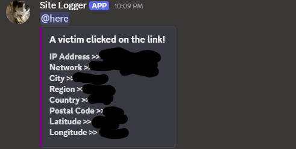

# 🕵️ Website-IP-Logger-by-nissim

A stealth-based landing website that collects visitor IP information and sends it to Discord in the background.

The website appears as a normal preview/landing page while silently logging visitors.

Created for testing, monitoring, and educational research.

By Nissim Amos.

---

## 📌 What This Website Does

When someone opens this website:

✔️ A preview page is displayed  
✔️ An image is shown to the visitor  
✔️ The visitor thinks it is a normal site  
✔️ In the background, their IP is collected  
✔️ The data is sent instantly to Discord  

No interaction is required.

---

## 🎯 Main Purpose

This project is designed for:

- Traffic tracking
- Security testing
- Visitor analysis
- Learning web logging systems
- Monitoring unknown visitors

---

## 🖼️ Preview Page

The visitor only sees:

- A simple landing page
- An image / banner
- Optional text
- No visible tracking system

Example: